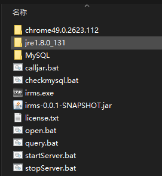

# READ ME

​	记录下本次项目踩过的坑，几乎是摸着石头过河。

## 需求

​	双击exe后，弹出启动画面，显示正在执行的过程。具体过程是：

1. 显示启动画面
2. 检查java环境
3. 检查mysql环境，无则安装mysql服务，并启动服务
4. 启动jar包
5. 遍历端口，比如8080。若有连接则代表jar包启动完成
6. 隐藏启动界面，显示系统托盘。可以退出程序或者重新打开指定url
7. 打开指定浏览器的指定url (不可修改url)

## 缘由

​	项目中的一个功能。原本是b/s项目，一台服务器，其他电脑直接浏览器访问即可。但是客户想要exe启动的这种样子，并且还不能对外联网（要求独立环境）。无奈b/s已经做得差不多了，所以想用这个MFC包装一下，假装是个正经exe应用。

## bat

​	

[bat.md](bat.md)

## mfc

[mfc.md](./mfc.md)

## 文件路径

目标文件就是irms.exe 执行过程中会调用一些bat。有的bat在MySQL目录下。
